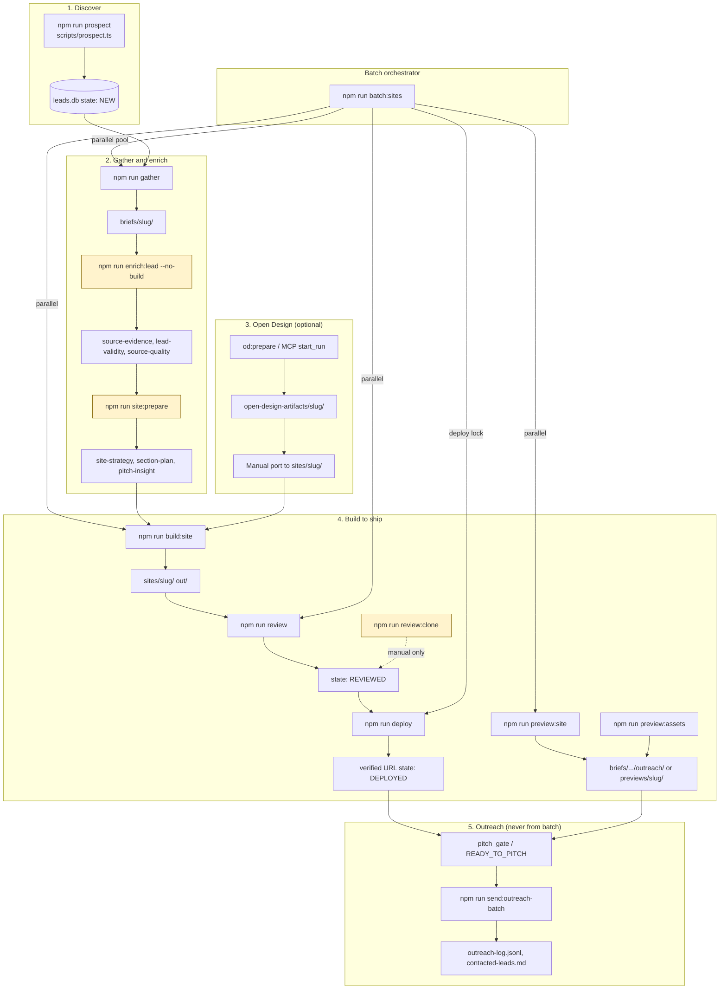

# WebForTrades pipeline audit — 2026-06-11

**Type:** Phase 1 read-only audit  
**Project:** `/Users/iuliusprodan/.cursor/website`  
**Auditors:** Parallel read-only subagents (pipeline, bugs, speed/quality, safety/tests, config/docs)  
**No code, config, deploy, or outreach changes were made during this audit.**

---

## Section 1: Executive summary

The WebForTrades pipeline is **functionally capable end-to-end**: prospecting, gather, enrich, Open Design port, build, review, deploy with alias verification, preview assets, and outreach with batch approval mode all exist and have been exercised on real Bristol/Sheffield/Manchester cohorts in June 2026. What works well: SQLite dedupe and WAL under batch concurrency, Vercel alias locking, contactability gating, draft-based outreach with safety flag reset, live style verification catching broken deploys, and the June 2026 polish pass that moved clone scores from FAIL (29–39) to PASS (16–32) on the five-site outreach cohort.

What is **fragile**:

1. **Automation gaps** — `batch_sites.ts` does not run `enrich:lead`, `site:prepare`, or `review:clone`; several `config.yaml` `site_design` flags are never read by code. Documented gates and automated gates diverge.
2. **Duplicate paths** — Two preview pipelines (`preview:site` vs `preview:assets`), four WhatsApp send entry points, and twelve copies of `loadEnv()` increase drift risk.
3. **Deploy and capture dominate wall clock** — Measured at 248–332 s per site for OG+scroll+redeploy; deploy+live style verify at 5–6 min/site in polish runs. Review stage can hang 312–325 s vs ~30 s healthy.
4. **Outreach safety is layered but not airtight** — `test_recipient_only` is not enforced in `whatsapp_gateway.ts`; legacy `send_whatsapp_caption_pitches.ts` lacks PITCHED guard and uses hardcoded targets.
5. **Quality enforcement is uneven** — Section integrity runs at deploy; clone review and owner-name title ban are manual; `batch-status.json` can lag `clone-review.json`; 91% section overlap warnings persist even after PASS.

**Top 5 wins (impact / effort):**

| Rank | Win | Why |
|------|-----|-----|
| 1 | Wire `review:clone` into `batch_sites.ts` after build | Blocks OD template ports before deploy; docs already require it |
| 2 | Guard `build:site` against wiping Open Design ports | One mistaken command destroys hours of port work |
| 3 | Enforce `test_recipient_only` in `whatsapp_gateway.ts` | Closes live-send hole if `sending_enabled` flipped manually |
| 4 | Metadata-only redeploy path for OG+scroll (skip triple `next build`) | Saves ~8–15 min per five-site capture batch |
| 5 | Load and enforce `site_design` flags via `site_config.ts` | Makes wordmark/owner-title/matrix rules real, not memory-only |

---

## Section 2: Pipeline diagram and step table

### Mermaid diagram

Yellow nodes = mandatory in docs but **not fully automated** in `batch_sites.ts`.

### Step-by-step table

| Step | Script(s) | Inputs | Outputs | Gates | Typical duration (recent) | Failure modes |
|------|-----------|--------|---------|-------|-------------------------|---------------|
| Prospect | `prospect.ts` | location, niche, Places API | `leads.db` NEW rows | dedupe, geo, website classify, root `approval_mode` | Not timed in batches | zero candidates, misclassified social as website |
| Gather | `gather.ts` | slug, Places, optional Facebook | `brief.json`, images, GATHERED | MIN_PHOTOS, contactability | 16–22 s/slug; 0 ms if batch skips re-gather | weak photos, OpenWA down → NEEDS_MANUAL_REVIEW |
| Enrich | `enrich:lead.ts` | brief, directories, Facebook | source-evidence, lead-validity, source-quality | enrichment_complete, ready_for_build | Manual pre-batch | HAS_REAL_SITE, location mismatch, Apify blocked |
| Site prepare | `site:prepare.ts` | enriched brief | strategy, section-plan, pitch-insight | site_artifacts.ts | Manual/agent | generic section plan |
| Open Design | MCP / `od:*` | evidence artifacts | `open-design-artifacts/` | od:check, human review | ~33 min wall (5 parallel) | auth fail, agent loop, missing data-section-id |
| Build | `build.ts` | briefs, creative-constraint | `sites/slug/`, BUILT | checklist, artifacts, contactability | ~96–101 s | wipes OD port; template swap-test fail |
| Preview (A) | `preview_site.ts` | static out/ | briefs/.../outreach/, public copies | dev indicator, banned text | ~45–46 s | path mismatch vs pitch_gate |
| Preview (B) | `preview_assets.ts`, `og_scroll_site.ts` | live URL | og.png, previews/scroll.mp4 | export race, section_integrity | 135–332 s + redeploy | 3/5 failed first og-scroll wave |
| Review | `review.ts` | REVIEWED candidate | screenshots, build-notes | template headings, palette uniqueness | ~30 s healthy; 312–325 s hangs | clone/template failures (4 early June batches) |
| Clone review | `clone_review.ts` | built HTML | clone-review.json | score ≥35 FAIL | Manual | 100% overlap without section IDs |
| Deploy | `deploy.ts` | REVIEWED, Vercel token | deploy.json, DEPLOYED | section_integrity, style verify, alias verify | 78–83 s job; 5–6 min with full verify | stale alias, EPIPE, manifest desync |
| Batch | `batch_sites.ts` | location, niche, count | data/batches/*/ | READY_TO_PITCH eval, no outreach | 2-site ~4.5 min/stages; og-scroll ~45 min | review failures dominate early runs |
| Outreach | `outreach/send.ts`, send_one | drafts, OpenWA | PITCHED, logs | sending_enabled, pitch_gate, approval_mode | 60–180 s between leads | OpenWA session, WA unavailable |

### Bottlenecks vs parallelism

| Phase | Parallel? | Notes |
|-------|-----------|-------|
| Lead selection, creative direction | Serial | Central in batch_sites |
| gather → build → preview → review | Yes (default concurrency 3) | Unique ports per worker |
| Deploy + alias | Limited (deploy_concurrency default **1** in code) | Global Vercel file lock |
| Open Design | External parallel | Agent-bound |
| OG+scroll batch | Partial | Serial retry after parallel failures |
| Outreach | Serial by design | Cooldowns, single OpenWA session |

### Dead code / duplication

| Item | Location | Notes |
|------|----------|-------|
| `send_whatsapp_caption_pitches.ts` | Hardcoded jt-plumbing era TARGETS | Bypasses batch orchestrator |
| `batch_setup_direction.ts` | Hardcoded one batch id | One-off helper |
| `loadEnv()` | 12+ scripts | `load_env_local.ts` not universal |
| Preview dual paths | preview_site vs preview_assets | og-image.png vs og.png; site-scroll paths differ |
| `review:clone` | Not called from batch/review/deploy | Documented gate, manual only |

---

## Section 3: Bugs table

| ID | File:line (approx) | Severity | Repro | Suggested fix | Fix risk |
|----|-------------------|----------|-------|---------------|----------|
| B-01 | `scripts/build.ts:411-415` | **High** | Run `build:site` after OD port | Skip rmSync+copy when OD port marker / `od_port_use_next_build_only` | High |
| B-02 | `scripts/clone_review.ts:117-144` | **High** | OD port without data-section-id → ~100% overlap | Fail preflight if fewer than 3 section IDs in built HTML | Low |
| B-03 | `scripts/batch_apply_waivers.ts:161-169` | **High** | HAS_REAL_SITE + ready_for_build after waiver | Separate redesign approval; do not flip ready_for_build | Medium |
| B-04 | `scripts/pitch_gate.ts` | **High** | Stay Dry pitched as no-site lead | Block on pitch_type / has_real_website unless redesign flag | Medium |
| B-05 | `briefs/nfs-plumbing-heating/batch-status.json:13` | Medium | batch report shows build_id `:pending` | Reject pending at verify; sync from site-metadata | Low |
| B-06 | `scripts/checks/section_integrity.ts:117-123` | Medium | BBR gallery-masonry missed by `.gallery` only | Unified gallery selector list | Medium |
| B-07 | `scripts/og_scroll_site.ts:68-87` | Medium | Gallery verify hardcoded `.gallery--masonry` | Reuse section_integrity collectors | Low |
| B-08 | `scripts/openwa_ensure.ts:170-177` | Medium | Session env is name; start uses raw id | Resolve session id like whatsapp_gateway | Low |
| B-09 | `scripts/openwa_ensure.ts:184-186` | Medium | Session start fails silently | Log HTTP status in EnsureOpenWAResult | Low |
| B-10 | `prospect.ts` / `gather.ts` / `directory_probe.ts` | Medium | Apostrophe slug mismatch across steps | Shared normalizeSlug() | Medium |
| B-11 | `scripts/batch_sites.ts:457-468` | Medium | Job FAILED despite VERIFIED alias on disk | Separate npm exit from stale manifest | Low |
| B-12 | `scripts/batch_sites.ts:369-371` | Medium | Corrupt lead-validity JSON swallowed | Hard-fail unless explicit override | Low |
| B-13 | `scripts/og_scroll_site.ts:126-127` | Medium | OG redeploy skips live style verify | Skip only when same buildId verified | Medium |
| B-14 | `scripts/send_whatsapp_caption_pitches.ts:43-67` | Medium | Hardcoded live targets | Delete or require manifest + PITCHED guard | Low |
| B-15 | `scripts/outreach_log.ts:364-370` | Medium | Running script as main runs backfill | Require explicit `--backfill` flag | Low |
| B-16 | `scripts/whatsapp_gateway.ts` | Medium | sending_enabled=true in yaml → any caller sends live | Enforce test_recipient_only in gateway | Low |
| B-17 | `scripts/send_whatsapp_caption_pitches.ts` | Medium | No PITCHED check | Add PITCHED guard like send_one | Low |
| B-18 | `briefs/bristol-plumbing-co/brief.json` | Medium | Committed Google API key in photo URLs | Strip key= from stored URLs; rotate key | Low |
| B-19 | `scripts/preview_video.ts:162,195` | Low | Silent catch on page load | Fail capture on timeout | Low |
| B-20 | `scripts/open_design_status.ts:12` | Low | Hardcoded OD path | OPEN_DESIGN_ROOT env | Low |
| B-21 | `scripts/outreach/send_one.ts` (log fields) | Low | Logs sending_enabled_final=false on live sends | Read actual flags after send | Low |

---

## Section 4: Speed wins table

| ID | Step | Current time (observed) | Target | Change | Est. savings (5 sites) | Risk |
|----|------|-------------------------|--------|--------|------------------------|------|
| S-01 | OG+scroll+redeploy | 270–332 s/site | ~120 s | Metadata-only deploy; skip 2nd/3rd next build when out/ unchanged | 8–15 min batch | Medium |
| S-02 | Deploy + live style verify | 248 s–6 min/site | ~90 s | deploy_concurrency=2; skip live verify for metadata-only | 10–15 min polish batch | Medium |
| S-03 | Playwright OG+scroll | 2 browser launches/site | 1 | Shared browser pool per worker | 2–4 min | Low |
| S-04 | OG+scroll parallel wave | 45 min wall, 3/5 fail | ~25 min | Fix export race + dev-badge before parallel wave | 15–20 min | Medium |
| S-05 | review stage hang | 312–325 s vs 30 s | ~30 s | Static out/ server; tighter timeout; port isolation audit | Avoids full batch retry | Low |
| S-06 | npm install per build | 18–40 s cold | ~5 s | Persistent node_modules; skip ci when lock unchanged | 3–5 min/site cold | Low |
| S-07 | Open Design generation | 142–252 s serial | overlap | Start OD when enrich completes | 4–8 min wall | Low |
| S-08 | preview_assets slug loop | Serial for loop | Parallel | Promise.all with port pool | ~40% capture phase | Medium |
| S-09 | OG regeneration | Always regenerate | Reuse | Default reuse when dimensions valid | 30–60 s/site | Low |
| S-10 | Failed deploy after capture | Full redeploy cycle | Fail fast | section_integrity in build:site before deploy | 2–5 min/site avoided | Low |

---

## Section 5: Quality wins table

| ID | Gap | Current state | Action | Impact |
|----|-----|---------------|--------|--------|
| Q-01 | Clone review in batch | Manual `review:clone` only | Wire into batch_sites after build | Blocks template ports pre-deploy |
| Q-02 | Owner-name section titles | config flag unused | Enforce in review.ts / clone_review.ts | Catches "Customers mention {name}" regressions |
| Q-03 | text_only_wordmarks | memory + yaml only | Load flag; check in od:check + review | Stops logo-as-wordmark drift |
| Q-04 | batch-status vs clone-review drift | Stale FAIL in batch-status | Sync on clone pass (batch_write_status) | Accurate pitch gates |
| Q-05 | HAS_REAL_SITE pitch framing | stay-dry built under waiver | Block batch build unless --allow-redesign-pitch | Correct outreach angle |
| Q-06 | Location mismatch pre-build | alexander built then fixed in polish | Gate at site:prepare / batch selection | Saves rework |
| Q-07 | jt-plumbing clone regression | Score 29, 100% template order | Section-variation matrix + redeploy | Removes overlap anchor |
| Q-08 | 91% overlap warnings post-PASS | Shared OD section stack | Vary section names in matrix, not just order | Stronger batch uniqueness |
| Q-09 | OG/scroll coverage | 7/15 sites have full assets | --require-preview-assets in batch | Outreach-ready consistency |
| Q-10 | Gallery integrity west-park | style verify warn only | Require gallery or explicit waiver | Prevents single-column regression |
| Q-11 | Banned-word lists split | review, od:check, preview_capture | Single shared module | Fewer false positives (NFS r1) |
| Q-12 | BBR stale alias | -bristol may serve old HTML | Alias sweep in deploy | Verified URL matches latest build |
| Q-13 | AI image guardrails | images_generate exists | Wire must-not-appear rules into gallery vs hero selectors in review | Prevents letterhead in gallery |
| Q-14 | Manifest hygiene | manual in source-evidence | Auto-flag letterhead/card in enrich | Keeps hero/gallery clean |

---

## Section 6: Reliability and safety findings

### sending_enabled / test_recipient_only

| Writer | File | Notes |
|--------|------|-------|
| Only mutator | `scripts/test_recipient.ts` | enableLiveOutreach, resetOutreachSafety |
| Send gate | `whatsapp_gateway.ts` | Checks **sending_enabled only** |
| Orchestrator | `outreach/send.ts` | Enables live, drift check, reset in finally |
| Legacy | send_whatsapp_pitch, caption_pitches, outreach.ts | Each enables/resets independently |

**Finding:** Manual `sending_enabled: true` in config.yaml bypasses test redirect because gateway does not read `test_recipient_only`.

### contacted-leads.md and outreach-log.jsonl

| Writer | Path |
|--------|------|
| Canonical | `outreach_log.ts` via logSuccessfulOutreachSend |
| Callers | send_one.ts, send_whatsapp_pitch.ts, send_whatsapp_caption_pitches.ts, backfill CLI |

**Finding:** outreach.ts test send updates DB to PITCHED without writing logs (by design for test number).

### Send paths outside batch orchestrator

| Script | Risk |
|--------|------|
| `send_whatsapp_caption_pitches.ts` | Hardcoded targets, no PITCHED guard |
| `send_whatsapp_pitch.ts` | Legacy single-lead; bypasses send_one draft files |
| `outreach.ts --send` | Test number only; sets PITCHED without contacted log |
| `check_replies.ts` | Email follow-ups; no test_recipient redirect |

### Test/dry-run vs live gateway

| Command | Hits OpenWA | Sends |
|---------|-------------|-------|
| test:openwa (default) | Yes (health, WA check) | No |
| test:openwa --send-test | Yes | Yes to MY_OWN_TEST_NUMBER if sending_enabled |
| send:outreach-batch --preflight | Yes (WA availability per lead) | No |
| gather / contactability | Yes when enabled | No |

### OpenWA mid-batch recovery

- **Implemented:** hard stop on gateway_unreachable; failure budget >1; safetyFlagsDrifted; resetOutreachSafety in finally.
- **Gaps:** No re-check between text1/text2/video in one pitch; partial send + re-run can duplicate text; no batch resume checkpoint.

### Idempotency

| Layer | Behaviour |
|-------|-----------|
| PITCHED guard | send_one, send_whatsapp_pitch yes; caption_pitches, outreach.ts test **no** |
| outreach_log dedup | By send_id and slug/channel/touch |
| PitchSendGuard | Max 2 text + 1 video per run |
| Deploy alias | File lock; already_ours skip |
| DB logWhatsAppSend | No unique constraint |

---

## Section 7: Test coverage gaps

### Existing unit tests

| File | Covers |
|------|--------|
| checks/batch_approval.test.ts | batch approval parse, hard stops, approval mode |
| checks/outreach_format.test.ts | message formatting, link spacing |
| checks/section_integrity.test.ts | gallery columns, promise copy |
| deploy_alias.test.ts | alias candidates, verifyDeployedSite (mocked) |
| style_verify.test.ts | CSS/font/layout helpers |
| contactability.test.ts | qualification matrix |
| sources.test.ts, source_extraction.test.ts | enrichment helpers |
| website_classify, facebook_*, apify_* | source probes |
| images_generate.test.ts | prompts (uses real west-park brief data) |

### High-risk scripts without dedicated tests

| Script | Risk |
|--------|------|
| outreach/send.ts, send_one.ts | Live batch orchestration, flag drift |
| send_whatsapp_pitch.ts, caption_pitches.ts | Legacy live sends |
| vercel_alias.ts assignVercelAlias | CLI + lock integration |
| clone_review.ts | READY_TO_PITCH gate logic |
| asset_readiness.ts | OD / photo-led build gate |

### Flaky / skipped

- No explicit skip markers in test files.
- `images_generate.test.ts` depends on persisted west-park brief (brittle).
- Live scripts: test_email, test_openwa, test_qualification --live.

---

## Section 8: Config and secret findings

| Finding | Severity | Detail |
|---------|----------|--------|
| Committed Google API key | **High** | `briefs/bristol-plumbing-co/brief.json` photo URLs contain live key |
| Gemini env file mismatch | Medium | `.env.example` at root; runtime reads `.env.local` via load_env_local |
| VERCEL_TOKEN undocumented | Medium | Required for deploy; not in .env.example |
| site_design flags inert | Medium | text_only_wordmarks, ban_owner_name_section_titles, require_section_variation_matrix, od_port_use_next_build_only not loaded by site_config.ts |
| SMTP port conflict | Low | config.yaml comment says 465; mail_config defaults 587 |
| OPENWA_MEDIA_HOST undocumented | Low | Defaults host.docker.internal |

### Env var behaviour summary

| Loud fail | Silent degrade |
|-----------|----------------|
| GOOGLE_PLACES_API_KEY (prospect/gather) | Apify/Meta Graph when tokens missing |
| SMTP/IMAP on send/check | WhatsApp check → unknown if OpenWA env incomplete |
| VERCEL_TOKEN if CLI not logged in | WFT_* ports default silently |
| GEMINI via .env.local for images:generate | |

---

## Section 9: Documentation gaps

| Rule / topic | In memory.md | Canonical doc | Code enforced |
|--------------|--------------|---------------|---------------|
| Text-only wordmarks | Yes | open-design-webfortrades-brief-format.md | **No** |
| Owner-name section title ban | Yes | Same OD doc | **No** |
| Section integrity | Yes | checklist + OD doc | **Yes** (deploy, style_verify) |
| Contactability gate | Yes | README, .cursorrules | **Yes** |
| Batch approval mode | Yes | prompts/outreach.md | **Yes** (send.ts) |
| Brand-led alias rule | Yes | OD doc | **Partial** (vercel_alias slug-first) |
| Manifest hygiene | Yes | OD doc | **No** |
| review:clone before pitch | .cursorrules | checklist | **No** in batch |
| AGENTS.md | N/A | **Missing** | — |
| pipeline-audit.md (2026-06-10) | — | **Stale** (pre-OD) | — |
| README send:outreach-batch | — | **Missing** | exists in package.json |

**Promote to canonical:** Consolidate OD brief-format §Permanent port rules into `.cursorrules` and `prompts/site-build-checklist.md`. Refresh or archive `docs/webfortrades-website-pipeline-audit.md`.

---

## Section 10: Recommended phase 2 work

Reply with `apply do-now`, `apply do-now and do-soon`, `apply <ids>`, or `discuss <id>`.

### Do now (high impact, low risk)

| ID | Item | Justification |
|----|------|---------------|
| DN-01 | Enforce `test_recipient_only` in `whatsapp_gateway.ts` (B-16) | Closes live-send hole; one guard, high safety value |
| DN-02 | Add PITCHED guard to `send_whatsapp_caption_pitches.ts`; deprecate hardcoded TARGETS (B-14, B-17) | Prevents duplicate/wrong-target sends |
| DN-03 | Fix OpenWA session start to resolve id by name (B-08, B-09) | Already hit in production; low-risk patch |
| DN-04 | Require `--backfill` flag on outreach_log.ts main (B-15) | Prevents accidental log writes |
| DN-05 | Unify gallery selectors in section_integrity + og_scroll_site (B-06, B-07) | Fixes false pass/fail on masonry/strip layouts |
| DN-06 | Strip committed API key from bristol-plumbing-co brief URLs (B-18) | Security hygiene |
| DN-07 | Sync batch-status build_id / clone_review from latest artifacts (B-05, Q-04) | Stops stale pitch gate confusion |
| DN-08 | Add `send:outreach-batch`, `openwa:ensure`, `outreach.approval_mode` to README | Docs catch-up, zero runtime risk |

### Do soon (high impact, medium risk)

| ID | Item | Justification |
|----|------|---------------|
| DS-01 | Wire `review:clone` into batch_sites after build (Q-01) | Automates documented gate; may fail more batches until OD quality improves |
| DS-02 | Guard build.ts against OD port wipe (B-01) | Saves OD work; needs careful marker design |
| DS-03 | Load site_design flags in site_config.ts; enforce wordmarks + owner-title ban (Q-02, Q-03) | Makes config real |
| DS-04 | Metadata-only OG redeploy path (S-01, S-02) | Large wall-clock savings |
| DS-05 | HAS_REAL_SITE / redesign pitch gate in pitch_gate + batch (B-03, B-04, Q-05) | Prevents wrong pitch class |
| DS-06 | Shared normalizeSlug() across prospect/gather/directory (B-10) | Dedupe integrity |
| DS-07 | section_integrity in build:site preflight (S-10, Q-10) | Fail fast before deploy |
| DS-08 | Consolidate loadEnv into one module | Reduces env parsing drift |
| DS-09 | Unit tests for clone_review.ts and send_one dry-run paths | Safety net for phase 2 changes |
| DS-10 | Fix send_one log fields for actual safety flag state (B-21) | Audit trail accuracy |

### Discuss (high impact, high risk, or unclear scope)

| ID | Item | Justification |
|----|------|---------------|
| DC-01 | Run enrich:lead + site:prepare inside batch_sites workers | Big orchestrator change; may slow batches |
| DC-02 | Merge preview:site and preview:assets into one path | Breaking change for pitch_gate asset paths |
| DC-03 | Brand-led alias generation in vercel_alias.ts | Needs naming policy for all niches |
| DC-04 | Retire legacy send scripts; single send entry point | Migration plan for existing workflows |
| DC-05 | Skip live style verify selectively | Risk of shipping broken CSS |
| DC-06 | Batch resume / partial-pitch recovery | Complex state machine |
| DC-07 | Wire images_generate guardrails into review gallery checks | Needs clear AI vs photo rules |

### Skip (low value)

| ID | Item | Justification |
|----|------|---------------|
| SK-01 | Add AGENTS.md duplicate of .cursorrules | .cursorrules already loaded; low ROI unless external agents require it |
| SK-02 | Parallelise preview_assets before fixing export race | S-04 prerequisite; parallel now increases failure rate |
| SK-03 | ffmpeg re-encode optimisation | Recent batches 1.6–3.1 MB; not a bottleneck |
| SK-04 | Hardcode OPEN_DESIGN_ROOT only fix | Low frequency; env var sufficient (B-20) |

---

## Audit metadata

| Check | Result |
|-------|--------|
| Code changes | None (except this report) |
| Config changes | None |
| Deployments | None |
| Outreach sends | None |
| `outreach.sending_enabled` | **false** (verified) |
| `outreach.approval_mode` | **per_send** (verified) |
| `outreach/contacted-leads.md` | Unchanged (290 lines) |
| `data/outreach-log.jsonl` | Unchanged (7 lines) |
| Report path | `data/audits/2026-06-11-pipeline-audit.md` |
